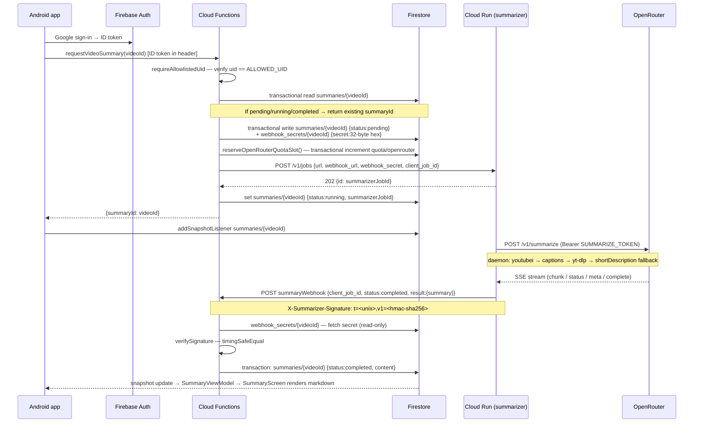
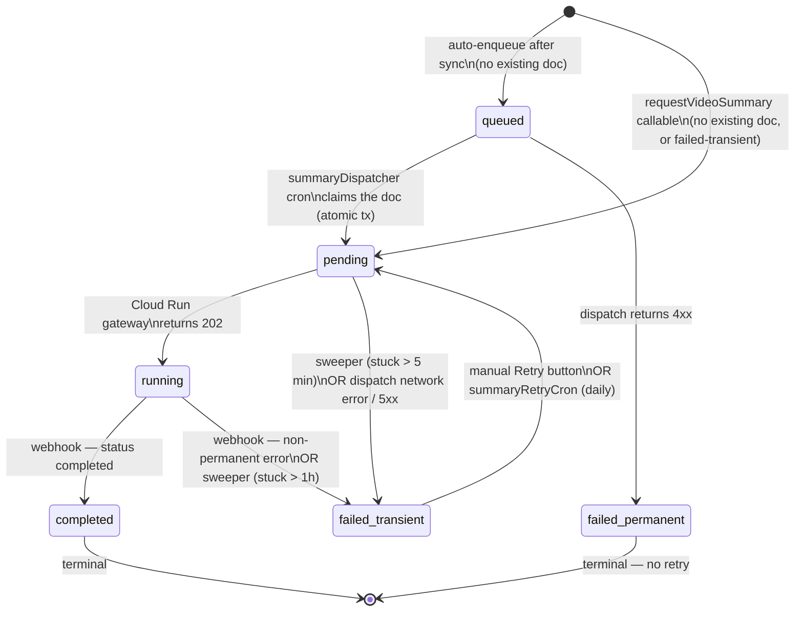

# The summarize pipeline

This document describes the machinery that carries a YouTube video from the Android app to a
generated markdown summary and back, and explains the design choices behind the key components.

Operational setup (secrets provisioning, Cloud Run deploy, uid capture) lives in
`docs/operations/deploy-and-bootstrap.md`.

---

## Contents

1. [End-to-end data flow](#1-end-to-end-data-flow)
2. [Firestore document schemas](#2-firestore-document-schemas)
3. [Status state machine](#3-status-state-machine)
4. [Auto-summarize enqueue path](#4-auto-summarize-enqueue-path)
5. [Webhook signature scheme](#5-webhook-signature-scheme)
6. [Cron functions and distributed locking](#6-cron-functions-and-distributed-locking)
7. [Single-tenant security model](#7-single-tenant-security-model)
8. [OpenRouter quota model](#8-openrouter-quota-model)
9. [Summarizer container and daemon subtree](#9-summarizer-container-and-daemon-subtree)

---

## 1. End-to-end data flow

### Manual-summarize path



### Auto-summarize path

After any sync operation writes new `videos/{videoId}` docs, `enqueueAutoSummary` runs and
creates `summaries/{videoId}` docs at `status: queued` for any video that has no existing
summary doc. The `summaryDispatcher` cron drains the queue every 5 minutes.

---

## 2. Firestore document schemas

### `summaries/{videoId}`

The document id is the YouTube video id. The Android client has read access; all writes are
via the Firebase Admin SDK (backend only).

| Field | Type | Description |
|---|---|---|
| `videoId` | `string` | YouTube video id (mirrors the doc id). |
| `status` | `SummaryStatus` | Current state — see [§3](#3-status-state-machine). |
| `model` | `string?` | LLM model identifier. Always `"free"` in v1. Optional for backward compat with pre-field docs. |
| `summarizerJobId` | `string?` | The job id returned by the Cloud Run gateway (`/v1/jobs`). Present after dispatch; absent on queued docs. |
| `content` | `string?` | Markdown summary text. Present only when `status == "completed"`. |
| `errorCode` | `string?` | Machine-readable failure code. Present when status is a failed variant. |
| `errorMessage` | `string?` | Human-readable failure detail. Present when status is a failed variant. |
| `requestedAt` | `Timestamp` | Server timestamp at first write (queued or pending). Preserved across re-dispatches. |
| `dispatchedAt` | `Timestamp?` | Server timestamp when the backend received a 2xx from the Cloud Run gateway. |
| `completedAt` | `Timestamp?` | Server timestamp written by the webhook handler on terminal transition. |

> The `webhookSecret` field appears in older doc snapshots but is deprecated. Secrets moved
> to `webhook_secrets/{videoId}` before v1 shipped. Any value in `webhookSecret` on old docs
> is not read by the backend and may be ignored.

### `webhook_secrets/{videoId}`

Server-only. Firestore rules deny all client reads (`allow read: if false`). Holds the
per-summary HMAC secret used to sign and verify the webhook from the Cloud Run service.

| Field | Type | Description |
|---|---|---|
| `secret` | `string` | 32-byte random value encoded as lowercase hex. Written at dispatch time; read by the webhook handler. |
| `createdAt` | `Timestamp` | Server timestamp at creation. |

### `quota/openrouter`

Single document. The Android client has read access (used to drive the quota banner).
All writes are via the Admin SDK.

| Field | Type | Description |
|---|---|---|
| `date` | `string` | UTC date string (`YYYY-MM-DD`) of the current tracking period. |
| `requestCount` | `number` | Number of successful reservations today. Resets to 0 on date rollover. |
| `dailyLimit` | `number` | Effective daily cap. Default: `1000`. |
| `perMinuteLimit` | `number` | Effective per-minute cap. Default: `20`. |
| `recentTimestamps` | `number[]` | Epoch-ms timestamps within the rolling 60-second window. Trimmed on each read. |
| `updatedAt` | `Timestamp` | Server timestamp of the last write. |

### `locks/{lockName}`

Used by all three cron functions for distributed mutual exclusion.

| Field | Type | Description |
|---|---|---|
| `acquiredAt` | `number` | Epoch-ms of the most recent acquisition. `0` means released. |
| `ttlMs` | `number` | TTL in ms recorded for observability; the actual check uses the constant from `constants.ts`. |

Lock doc paths: `locks/summaryDispatcher`, `locks/summarySweeper`, `locks/summaryRetry`.

---

## 3. Status state machine

A `summaries/{videoId}` document moves through the following states.



**Terminal statuses** (no further automatic transition): `completed`, `failed-transient`
(when no retry fires), `failed-permanent`.

**Idempotency guard.** The `dispatchSummary` function treats `pending`, `running`, and
`completed` as non-redispatchable. A doc at `queued` or `failed-transient` is eligible for
re-dispatch. The dispatcher cron flips `queued → pending` inside a Firestore transaction
before calling `dispatchSummary`, so concurrent cron + manual callable races resolve to a
single dispatch.

**Webhook idempotency.** The webhook handler checks the current status inside a transaction.
If the doc is already at a terminal status and the inbound status matches, it returns 204
(idempotent re-delivery). If the statuses conflict, the first terminal status wins and the
handler returns 200 with body `already-terminal`.

---

## 4. Auto-summarize enqueue path

After every successful sync that writes `videos/{videoId}` docs, `enqueueAutoSummary` is
called with the list of video ids. For each id it runs a per-doc transaction:

- If `summaries/{videoId}` does not exist: create it at `status: queued`, `model: "free"`.
- If it already exists (any status): skip without error.

This means a video that was previously summarized (or is currently being summarized) will
not produce a duplicate queued doc. Quota is not checked here — it is deferred to the
dispatcher, which holds the single authoritative gate.

---

## 5. Webhook signature scheme

The summarizer Cloud Run service signs every terminal webhook POST using a Stripe-style
HMAC-SHA256 scheme. The backend verifies the signature before touching Firestore state.

### Signing (Cloud Run → backend)

**Canonical message:** `${timestamp}.${rawBody}`

- `timestamp` — Unix seconds (`Math.floor(Date.now() / 1000)`).
- `rawBody` — the exact UTF-8 bytes of the POST body (before any JSON parse).

**Algorithm:** HMAC-SHA256, key = the per-summary `webhook_secret`, output as lowercase hex.

**Header format:**

```
X-Summarizer-Signature: t=<unix-seconds>,v1=<hmac-sha256-hex>
```

Example:

```
X-Summarizer-Signature: t=1716000000,v1=a3f2...c8b1
```

### Verification (backend webhook handler)

1. Parse the `X-Summarizer-Signature` header into `t` (number) and `v1` (hex string). Reject
   with **400** if either is absent or malformed.
2. Compute `|now − t|`. Reject with **401** if it exceeds **300 seconds** (the replay window).
3. Fetch `webhook_secrets/{client_job_id}` from Firestore. If the doc does not exist,
   `secret` is the empty string and step 4 will always fail.
4. Recompute HMAC over `${t}.${rawBody}`. Compare with `crypto.timingSafeEqual`. Reject with
   **401** on mismatch.
5. Open a Firestore transaction, read `summaries/{client_job_id}`. If the doc does not exist,
   return **401** (same response as a bad signature — the unknown-job path is not enumerable).
6. If the doc is already at a terminal status, return 204 (idempotent) or 200
   (`already-terminal` on status conflict).
7. Write the terminal update. Return **204**.

### Why 401 for an unknown job (not 404)

A valid signature for an unknown `client_job_id` is structurally impossible: the
`webhook_secrets/{id}` document does not exist, so the HMAC comparison uses an empty key and
always fails. The signature-failure path and the unknown-job path therefore return the same
**401**, making it impossible for an attacker to enumerate which job ids the backend knows
about.

### Per-summary secrets

Each dispatch generates a fresh 32-byte random secret (stored in `webhook_secrets/{videoId}`)
and passes it to the Cloud Run gateway in the job submission. A leaked secret compromises only
one summary, not the entire pipeline. The secret is never written to the `summaries/` doc;
`webhook_secrets/` is deny-all in Firestore rules.

### Key versioning

v1 ships a single active key version (`v1=` header field). Stripe-style parallel `v0`+`v1`
verification for key rotation is out of scope for v1.

---

## 6. Cron functions and distributed locking

### Distributed lock helper (`lock.ts`)

All three cron functions use the same `acquireCronLock` / `releaseCronLock` pair backed by a
Firestore document.

**Acquire:** Runs a Firestore transaction that reads the lock doc and checks
`now − acquiredAt < ttlMs`. If the lock is held and within TTL it returns `false` (skip).
Otherwise it sets `acquiredAt = now` and returns `true` (acquired), including stale-lock
reclaim.

**Release:** Best-effort `set({acquiredAt: 0}, {merge: true})`. Logs a warning on failure but
never throws, so the caller's `finally` block always completes.

**Belt-and-suspenders:** All three functions are also declared with `maxInstances: 1` on the
Cloud Scheduler trigger, preventing Cloud Run from starting a second concurrent instance at
the scheduler layer. The lock is the primary guard; `maxInstances: 1` is the secondary guard.

### `summaryDispatcher` (every 5 minutes)

| Property | Value |
|---|---|
| Schedule | `every 5 minutes` |
| Lock doc | `locks/summaryDispatcher` |
| Lock TTL | 600 000 ms (10 min) |
| Function timeout | 540 s |
| `maxInstances` | 1 |

**Behaviour:**

1. Acquire the lock (skip invocation if held).
2. Read `quota/openrouter` to get `remainingDaily`. Return early if `remainingDaily ≤ 0`.
3. Query `summaries` where `status == "queued"`, ordered by `requestedAt` ascending, limited
   to `remainingDaily` (up to `DISPATCHER_BATCH_SIZE = 200`).
4. Fan out `dispatchSummary` across all queued docs via `Promise.allSettled`.
5. On `resource-exhausted` with message `"Rate limit; try again in a moment."` (per-minute
   window full): leave the doc queued — the next 5-minute tick retries.
6. On `resource-exhausted` with message `"Daily summary limit reached…"`: log and continue.
7. Release the lock in `finally`.

The per-minute cap is not used to size the batch. The transactional reservation inside
`dispatchSummary` (`reserveOpenRouterQuotaSlot`) is the single source of truth for both
caps. Docs that hit the per-minute wall stay queued and are retried on the next cron tick
rather than transitioning to `failed-transient`.

### `summarySweeper` (hourly)

| Property | Value |
|---|---|
| Schedule | `every 1 hours` (UTC) |
| Lock doc | `locks/summarySweeper` |
| Lock TTL | 600 000 ms (10 min) |
| Function timeout | 540 s |
| `maxInstances` | 1 |

**Behaviour:** Two independent passes, each using `Promise.allSettled` fan-out with a
per-doc transaction that re-reads before writing (so a concurrent webhook completion between
query and flip is a no-op for that doc):

- **Running pass:** Docs where `status == "running"` and `requestedAt < now − 3 600 000 ms`
  (1 hour). Transition to `failed-transient`, `errorCode: "stuck_running_timeout"`.
- **Pending pass:** Docs where `status == "pending"` and `requestedAt < now − 300 000 ms`
  (5 minutes). Transition to `failed-transient`, `errorCode: "stuck_pending_timeout"`.
  Recovers docs where `dispatchSummary` committed the idempotency transaction
  (`queued → pending`) but crashed before the outbound HTTP call.

No quota interaction. No outbound HTTP.

### `summaryRetryCron` (daily at 04:00 UTC)

| Property | Value |
|---|---|
| Schedule | `0 4 * * *` (UTC) |
| Lock doc | `locks/summaryRetry` |
| Lock TTL | 600 000 ms (10 min) |
| Function timeout | 540 s |
| `maxInstances` | 1 |
| `retryCount` | 3 (Cloud Scheduler retry) |

**Behaviour:**

1. Acquire the lock.
2. Query `summaries` where `status == "failed-transient"`, ordered by `requestedAt` ascending,
   limited to `DISPATCHER_BATCH_SIZE = 200`.
3. Fan out `dispatchSummary` via `Promise.allSettled`.
4. On `resource-exhausted`: the idempotency transaction inside `dispatchSummary` has already
   flipped the doc to `pending`. The retry cron rolls that back in a separate transaction
   (re-read + conditional write: only write `failed-transient` if `status == "pending"`).
   This prevents the doc from being stranded at `pending` with no active summarizer job.
5. Release the lock in `finally`.

---

## 7. Single-tenant security model

The system is locked to a single operator identified by their Firebase Auth uid. Two
independent enforcement layers must both be satisfied for any read or write to succeed.

### Layer 1 — callable allowlist (`auth/verify.ts`)

Every `onCall` function (including `requestVideoSummary`) wraps with `allowlistedCall`, which
calls `requireAllowlistedUid` before the handler runs.

`requireAllowlistedUid` throws:
- `unauthenticated` — if no Firebase Auth context is attached to the call.
- `permission-denied` — if the caller's uid does not equal `ALLOWED_UID`.

`ALLOWED_UID` is a Firebase Functions param (`defineString`) deployed via Secret Manager or
an `.env.<project>` file. Its default value is the sentinel `"__BOOTSTRAP_UID__"`, which
causes all calls to fail with `permission-denied` until the operator provisions the real uid.

Cron functions (`onSchedule`) have no Auth context. They are triggered only by Cloud
Scheduler and are not exposed on a public callable URL.

`summaryWebhook` is an `onRequest` function (public URL) gated by HMAC signature
verification rather than Firebase Auth.

### Layer 2 — Firestore security rules (`firestore.rules`)

```
function isAllowlisted() {
  return request.auth != null && request.auth.uid == "<operator-uid>";
}
```

The uid is a **hardcoded string literal** in the deployed rules file. The placeholder
`"__BOOTSTRAP_UID__"` must be replaced before `firebase deploy`; a pre-deploy script
(`backend/scripts/check-allowlist-uid.sh`) enforces this.

**Access matrix:**

| Collection | Operator (allowlisted uid) | Any other uid | Admin SDK (backend) |
|---|---|---|---|
| `playlists/**` | read | deny | read + write |
| `videos/**` | read | deny | read + write |
| `summaries/**` | read | deny | read + write |
| `quota/**` | read | deny | read + write |
| `webhook_secrets/**` | deny | deny | read + write |
| `tokens/**` | deny | deny | read + write |
| Everything else | deny | deny | read + write |

All writes from the Android client are denied regardless of uid. Only the Firebase Admin SDK
(running in Cloud Functions) writes to Firestore.

### Why hardcoded uid vs. custom claims

A custom claim (e.g. `{operator: true}` set by the Admin SDK at sign-in) would allow the
rules to read `request.auth.token.operator` instead of comparing against a literal string.
Custom claims enable multi-tenant migration without redeploying rules.

For v1, hardcoded uid was chosen because:
- The system has exactly one principal; claims management adds operational complexity with no
  present benefit.
- The uid is stable (Google accounts do not rotate uids).
- The pre-deploy script makes the sentinel detectable in CI.

A multi-tenant migration would need to: switch `isAllowlisted()` to check a custom claim set
by the Admin SDK, update `requireAllowlistedUid` to accept a set of uids, and provision the
claim at sign-in via an `onCreate` Auth trigger.

---

## 8. OpenRouter quota model

### Free-tier cap

With a one-time $10 credit purchase, OpenRouter grants 1 000 requests per calendar day (UTC)
on free models. Without a credit, the cap is 50/day. The backend always operates as if the
$10 credit has been purchased (`OPENROUTER_DAILY_LIMIT = 1 000`).

There is also a per-minute cap of 20 requests (`OPENROUTER_PER_MINUTE_LIMIT = 20`), tracked
with a sliding 60-second window in `quota/openrouter.recentTimestamps`.

### Transactional reservation (`quota.ts`)

`reserveOpenRouterQuotaSlot` runs a Firestore transaction that:

1. Reads `quota/openrouter`.
2. Detects a UTC date rollover and resets `requestCount = 0` and `recentTimestamps = []` if
   the stored `date` does not match today.
3. Trims `recentTimestamps` to entries within the last 60 seconds.
4. Throws `HttpsError("resource-exhausted", "Daily summary limit reached…")` if
   `requestCount >= dailyLimit`.
5. Throws `HttpsError("resource-exhausted", "Rate limit; try again in a moment.")` if
   `recentTimestamps.length >= perMinuteLimit`.
6. Writes the incremented doc atomically.

**Pessimistic pre-increment:** The slot is reserved before the outbound HTTP call to the
Cloud Run summarizer. If the dispatch fails (network error, timeout, non-2xx), the caller
invokes `releaseOpenRouterQuotaSlot` as a best-effort decrement. Over-counting by 1–2 on a
failed release is acceptable; under-counting (burning past the hard cap) is not.

### Android quota visibility

The Android client has read access to `quota/openrouter` and maintains a real-time listener.
When `requestCount >= dailyLimit` the app renders a top-of-screen banner and disables all
Summarize controls. The state clears naturally at UTC midnight as the date rollover in the
next transactional read resets the count.

### OpenRouter model selection

The backend always passes `model: "free"` to the Cloud Run gateway. The summarize daemon's
`/v1/refresh-free` endpoint (called once at container startup) refreshes the active list of
free models from OpenRouter. Specific free model IDs are never hardcoded in this codebase;
the daemon manages the rotation internally.

---

## 9. Summarizer container and daemon subtree

### Container architecture

The Cloud Run service runs a single container image built from `summarizer/deploy/Dockerfile`.
Two processes run inside the container:

| Process | Binary / module | Port | Role |
|---|---|---|---|
| summarize-daemon | `/opt/daemon/dist/cli.js daemon run --token <SUMMARIZE_TOKEN> --port 8787` | `127.0.0.1:8787` | LLM orchestration, YouTube transcript extraction |
| summarize-api gateway | `/app/summarizer/summarize-api/dist/index.js` (imported in-process by entrypoint) | `0.0.0.0:$PORT` | Job queue, SSE fan-out, webhook delivery |

**Startup sequence (`entrypoint.js`):**

1. Spawn the daemon child process.
2. Poll `http://127.0.0.1:8787/health` until 200 (30 s timeout). Exit 1 if timeout.
3. POST `http://127.0.0.1:8787/v1/refresh-free` (skipped if `OPENROUTER_API_KEY` is not set).
4. Import the gateway in-process (`import("/app/summarizer/summarize-api/dist/index.js")`).

Tini (PID 1) reaps zombie processes. If the daemon exits, the container exits immediately so
Cloud Run recycles the instance rather than serving traffic on a dead daemon.

**Signal forwarding:** `SIGTERM` and `SIGINT` received by the entrypoint are forwarded to the
daemon child. A 10-second grace period is allowed before `SIGKILL`.

### Job flow inside the container

```
Backend  →  POST /v1/jobs  →  gateway (summarize-api)
                               stores job in SQLite, returns {id}
            ↓
            POST /v1/summarize  →  daemon
            streams SSE (chunk / status / meta / complete / error)
            ↓
            assemble chunks → deliverWebhook → Backend summaryWebhook
```

The gateway's `url-runner.ts` handles YouTube jobs. It forwards the `url` and a selected
subset of option keys to the daemon's `/v1/summarize` endpoint. The `mode` field in the
gateway job schema (`auto | website | youtube | media`) does not map to the daemon's internal
mode enum and is accepted but not forwarded. The daemon's YouTube-native extraction cascade
runs regardless.

### Summarize daemon — vendored subtree

The daemon source at `summarizer/summarize-daemon/` is a git subtree vendored from
`https://github.com/steipete/summarize`.

**Current pin:** commit `0ec12acc15c480fd4fc91f9d1ee4538c3adeb1de` (squash `8fcef862`,
pulled 2026-05-18). This commit includes upstream PRs #226 and #227, which add timing-safe
bearer comparison and failed-auth rate-limiting on `/v1/*` routes.

**Pin record:** `summarizer/summarize-daemon/SUBTREE_PIN.md` records the upstream commit,
local squash SHA, pull date, and the verification checklist that must pass before merging any
future pull.

**Refresh cadence:** Pin-on-incident only. Pull from upstream when:
- A CVE lands in the daemon or its transitive dependencies.
- A feature needed by this project lands upstream.
- Six months have elapsed since the last pull (hygiene).

**Refresh command:**

```sh
git subtree pull --prefix=summarizer/summarize-daemon \
  https://github.com/steipete/summarize <SHA-or-main> --squash \
  -m "chore(summarizer): pull summarize-daemon subtree to <SHA>"
```

After any pull, run the docker-compose harness at `summarizer/deploy/` against both fixture
flows (captioned and no-caption) and the replay-rejection check before merging.

### Required secrets

| Secret | Consumer | Purpose |
|---|---|---|
| `SUMMARIZE_TOKEN` | Container — entrypoint + gateway | Bearer token for entrypoint→daemon and gateway→daemon calls |
| `API_KEYS` (env: `SUMMARIZER_API_KEY` in backend) | Backend → gateway | `X-API-Key` header on `/v1/jobs` requests |
| `OPENROUTER_API_KEY` | Container (passed to daemon env) | LLM provider key for free-model access |
| `ALLOWED_UID` | Backend Cloud Functions | Single-tenant uid allowlist |
| `SUMMARIZER_URL` | Backend Cloud Functions | Cloud Run service URL |

`SUMMARIZE_TOKEN` and `SUMMARIZER_API_KEY` are provisioned in Secret Manager and referenced
via `defineSecret` in `backend/functions/src/summarizer/secrets.ts`.
